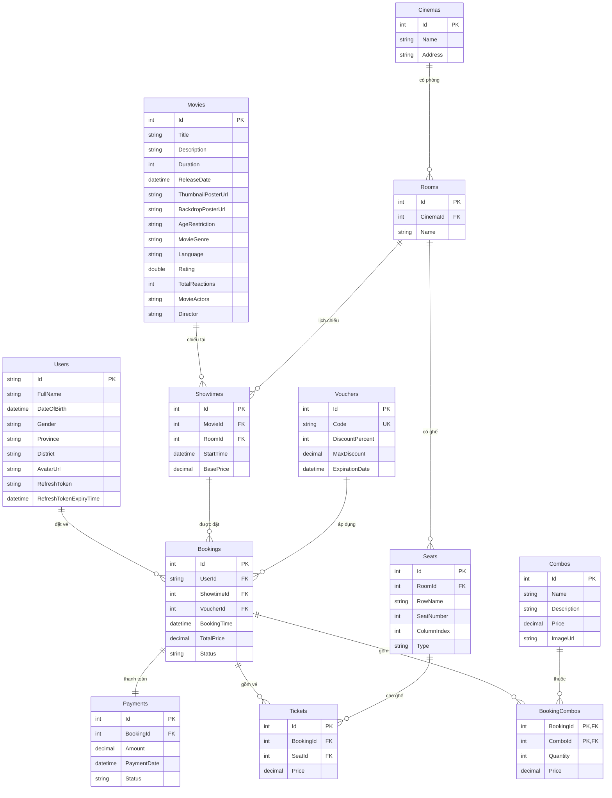

# 🎬 Phân Tích Cấu Trúc Database — The Sun Cinema App

## Tổng Quan Kiến Trúc

Dự án dùng **ASP.NET Core** + **Entity Framework Core** với pattern **Code-First**.  
`AppDbContext` kế thừa `IdentityDbContext<ApplicationUser>` — tức là hệ thống **xác thực người dùng (ASP.NET Identity) được tích hợp thẳng vào database**.

---

## Sơ Đồ Quan Hệ (ERD)



---

## Phân Tích Từng Nhóm Bảng

### 🏛️ Nhóm 1 — Cơ Sở Hạ Tầng Rạp Chiếu

> **Mục tiêu:** Mô hình hoá không gian vật lý của rạp phim.

```
Cinema (rạp)
  └── Room (phòng chiếu)
        └── Seat (ghế ngồi)
```

| Bảng | Vai trò | Điểm đáng chú ý |
|---|---|---|
| `Cinemas` | Rạp chiếu phim | Chỉ có `Name` + `Address`, đơn giản |
| `Rooms` | Phòng chiếu trong rạp | FK → `CinemaId` |
| `Seats` | Ghế ngồi trong phòng | **2 trường quan trọng:** `SeatNumber` (số in trên vé) và `ColumnIndex` (vị trí vật lý trong grid để frontend render sơ đồ ghế) |

**Thiết kế thông minh ở `Seat`:**
- `SeatNumber`: Đếm liên tục (1, 2, 3...) bỏ qua lối đi → số in trên vé
- `ColumnIndex`: Vị trí thực trong grid kể cả ô trống lối đi → frontend dùng để vẽ đúng sơ đồ rạp
- `Type`: `Standard | VIP | Couple` → dùng để tính giá vé khác nhau

---

### 🎥 Nhóm 2 — Phim & Lịch Chiếu

> **Mục tiêu:** Quản lý nội dung phim và lịch chiếu tại từng phòng.

```
Movie (phim)
  └── Showtime (suất chiếu) ← Room (phòng)
```

| Bảng | Vai trò | Điểm đáng chú ý |
|---|---|---|
| `Movies` | Thông tin phim | Có `ThumbnailPosterUrl` (card nhỏ) và `BackdropPosterUrl` (ảnh nền trang chi tiết) |
| `Showtimes` | Suất chiếu cụ thể | Kết nối `Movie` + `Room` + `StartTime` + `BasePrice` |

**Tại sao `BasePrice` nằm ở `Showtime` chứ không phải `Movie`?**  
→ Vì giá vé phụ thuộc vào **suất chiếu cụ thể** (giờ chiếu sớm/muộn, loại phòng 2D/3D/IMAX có thể khác nhau), không chỉ phụ thuộc vào phim.

---

### 👤 Nhóm 3 — Người Dùng & Xác Thực

> **Mục tiêu:** Tích hợp ASP.NET Identity, mở rộng thêm thông tin người dùng.

`ApplicationUser` kế thừa `IdentityUser`, nghĩa là tất cả các bảng Identity chuẩn đều tồn tại:

| Bảng (được đổi tên) | Nội dung |
|---|---|
| `Users` | ApplicationUser (có thêm: FullName, DOB, Gender, Province, District, AvatarUrl, RefreshToken) |
| `Roles` | Vai trò (Admin, User...) |
| `UserRoles` | Gán vai trò cho user |
| `UserClaims` | Claims của user |
| `UserLogins` | Đăng nhập ngoài (Google, Facebook...) |
| `RoleClaims` | Claims của role |
| `UserTokens` | Token xác thực |

**Lý do đổi tên bảng** (`builder.Entity<ApplicationUser>().ToTable("Users")`):  
→ EF Core mặc định đặt tên bảng theo class (`AspNetUsers`, `AspNetRoles`...). Đổi tên giúp DB gọn và thân thiện hơn.

**`RefreshToken` lưu trong DB:**  
→ Dùng để xác thực JWT — khi Access Token hết hạn, client dùng RefreshToken để lấy token mới mà không cần đăng nhập lại.

---

### 🛒 Nhóm 4 — Đặt Vé (Core Business Logic)

> **Mục tiêu:** Xử lý toàn bộ luồng đặt vé của người dùng.

```
User đặt vé cho Showtime
  └── Booking
        ├── Ticket × N (mỗi ghế 1 ticket)
        ├── BookingCombo × N (combo đồ ăn)
        ├── Voucher (tùy chọn)
        └── Payment (1-1)
```

#### `Booking` — Trung tâm của luồng đặt vé

```csharp
UserId       → ai đặt
ShowtimeId   → đặt suất nào
VoucherId?   → mã giảm giá (nullable)
BookingTime  → thời điểm đặt
TotalPrice   → tổng tiền đã tính xong
Status       → Pending | Confirmed | Cancelled
```

#### `Ticket` — Mỗi ghế ngồi = 1 vé

- `Booking` → `Ticket` là **1-N**: một lần đặt có thể mua nhiều ghế
- Mỗi `Ticket` lưu `SeatId` + `Price` riêng → giá có thể khác nhau do loại ghế (Standard/VIP/Couple)

#### `BookingCombo` — Bảng trung gian N-N

- Một `Booking` có thể chọn **nhiều loại Combo**
- Một `Combo` có thể xuất hiện trong **nhiều Booking**
- **Composite Primary Key**: `(BookingId, ComboId)` — không cần cột Id riêng
- Lưu thêm `Quantity` và `Price` (giá tại thời điểm đặt, tránh thay đổi giá ảnh hưởng lịch sử)

#### `Payment` — Quan hệ 1-1 với Booking

```csharp
// AppDbContext.cs
builder.Entity<Payment>()
    .HasOne(p => p.Booking)
    .WithOne(b => b.Payment)
    .HasForeignKey<Payment>(p => p.BookingId);
```

- Một `Booking` chỉ có **đúng 1** `Payment`
- Tách `Payment` khỏi `Booking` để linh hoạt hơn (có thể mở rộng: lưu `PaymentMethod`, `TransactionId`, `GatewayResponse`...)

---

### 🎟️ Nhóm 5 — Ưu Đãi

| Bảng | Vai trò |
|---|---|
| `Vouchers` | Mã giảm giá theo phần trăm, có trần giảm giá tối đa và hạn dùng |
| `Combos` | Combo đồ ăn bắp rang/nước (có ảnh, giá, mô tả) |

**Cách tính giảm giá của Voucher:**
```
Giảm = min(TotalPrice × DiscountPercent/100,  MaxDiscount)
```
→ Trần `MaxDiscount` bảo vệ doanh thu, tránh voucher giảm quá nhiều với đơn lớn.

**Unique index trên `Voucher.Code`:**
```csharp
builder.Entity<Voucher>()
    .HasIndex(v => v.Code)
    .IsUnique();
```
→ Đảm bảo không có 2 voucher trùng mã.

---

## Chiến Lược Cascade Delete

Đây là phần **quan trọng nhất** trong `OnModelCreating`, kiểm soát chuyện gì xảy ra khi xóa dữ liệu:

| Quan hệ | Hành vi | Lý do |
|---|---|---|
| `User` → `Booking` | **Restrict** | Không cho xóa User nếu còn đơn đặt vé → bảo toàn lịch sử giao dịch |
| `Showtime` → `Booking` | **Restrict** | Không xóa Showtime nếu đã có người đặt |
| `Movie` → `Showtime` | **Restrict** | Không xóa Movie nếu còn lịch chiếu |
| `Room` → `Showtime` | **Restrict** | Không xóa Room nếu còn lịch chiếu |
| `Seat` → `Ticket` | **Restrict** | Không xóa Seat nếu đã có vé |
| `Booking` → `Ticket` | **Cascade** | Xóa Booking thì xóa luôn Ticket → hợp lý vì Ticket không tồn tại độc lập |

> [!IMPORTANT]
> Tất cả các `Restrict` đều **chủ động** — EF Core thường tự đặt `Cascade` theo mặc định với SQL Server. Khi có nhiều đường dẫn cascade đến cùng một bảng, SQL Server sẽ báo lỗi, nên phải dùng `Restrict` thủ công.

---

## Cấu Hình Kiểu Dữ Liệu `decimal`

```csharp
.HasColumnType("decimal(10,2)")
```

Áp dụng cho: `Voucher.MaxDiscount`, `Combo.Price`, `Showtime.BasePrice`,  
`Booking.TotalPrice`, `BookingCombo.Price`, `Payment.Amount`, `Ticket.Price`

- **10 chữ số tổng**, **2 chữ số thập phân** → hỗ trợ giá đến 99,999,999.99
- Bắt buộc phải khai báo rõ khi dùng EF Core với SQL Server, nếu không EF sẽ dùng `decimal(18,2)` mặc định và có thể gây cảnh báo migration.

---

## Tóm Tắt Luồng Nghiệp Vụ Chính

```
[User] chọn [Movie]
   → xem danh sách [Showtime] (Movie + Room + StartTime + BasePrice)
   → chọn [Seat] trong [Room] (xem sơ đồ ghế qua ColumnIndex)
   → tạo [Booking] (gắn User + Showtime + Voucher?)
       → tạo [Ticket] cho mỗi Seat đã chọn (Price = BasePrice × hệ số loại ghế)
       → thêm [BookingCombo] nếu chọn đồ ăn
       → tạo [Payment] để thanh toán
   → Booking.Status: Pending → Confirmed (sau khi Payment thành công)
```
